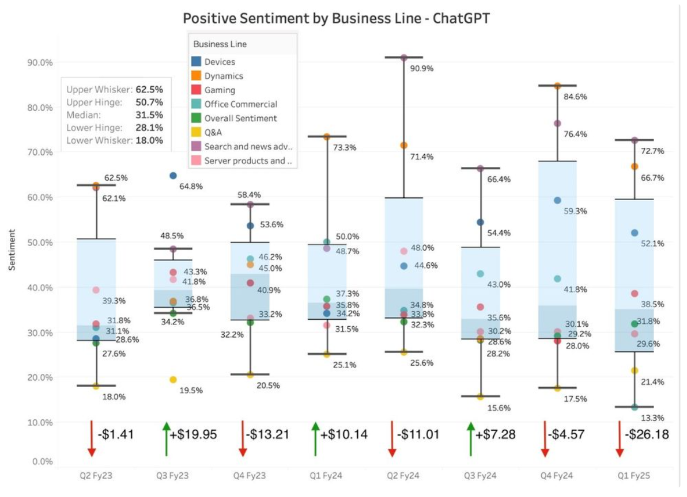

<p align="center">
  
</p>

<p align="center">
  <a href="https://arxiv.org/abs/2505.16090"></a>
  <a href="https://techcommunity.microsoft.com/blog/microsoft365copilotblog/llms-can-read-but-can-they-understand-wall-street-benchmarking-their-financial-i/4412043"></a>
  
</p>

A Streamlit app from the Santa Clara University × Microsoft practicum. It asks whether an LLM can
read a quarterly earnings call the way an analyst does. It breaks each call down by business line,
scores the sentiment of each part, and sets that against how the stock actually moved.

## Why it exists

Headline sentiment on an earnings call is a weak signal. Management is upbeat on almost every call.
The useful signal is *which* business line the tone shifts on. We found that sentiment on individual
segments, such as Devices or Search & News Advertising, often tracked next-day stock moves more closely
than the call's overall tone. Some ran inverse: a burst of optimism on Search & News Advertising came
before sell-offs.

## What's inside

| Tab | What it does |
|---|---|
| **Our Project** | The research: benchmarks, real-world testing on Microsoft transcripts, findings, and publications |
| **Try It Yourself** | Explore sentiment by business line on a Microsoft earnings call, chart it against the stock price, and question the call with a built-in chatbot |
| **About Us** | The team |

## The benchmark

Before touching Microsoft transcripts, we benchmarked every model on the Financial PhraseBank dataset:
FinBERT, VADER, TextBlob, Copilot 365, the Copilot app, ChatGPT-4o (with and without prompt
engineering), and Gemini 2.0 Flash.

<p align="center">
  
</p>

LLMs beat the traditional NLP tools clearly. The Copilot app led at 82.0%, ahead of ChatGPT-4o at
77.6%. Copilot 365 underperformed because it quietly falls back to TextBlob, which became one of our
recommendations to Microsoft.

<p align="center">
  
</p>

## Run it

```bash
python -m venv venv
venv\Scripts\activate          # macOS/Linux: source venv/bin/activate
pip install -r requirements.txt
streamlit run streamlit_app.py
```

The app asks for your OpenAI API key in the sidebar and keeps it only for your session. The scripts
in `extras/` read an Alpha Vantage key from the `ALPHA_VANTAGE_API_KEY` environment variable.

## Data

All inputs are public: Microsoft's published earnings call transcripts, historical MSFT prices, and
the Financial PhraseBank dataset.

## Team

Dominick Kubica, Dylan Gordon, Nanami Emura, Derleen Saini, and Charles Goldenberg. Santa Clara
University MS Business Analytics, in partnership with Microsoft.
